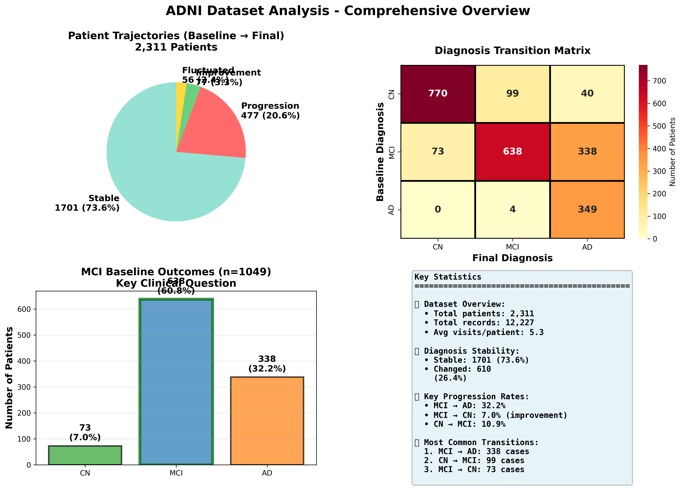

# ADNI Datasets Documentation

Comprehensive information about the ADNI (Alzheimer's Disease Neuroimaging Initiative) datasets used in this project.

## Comprehensive Overview



*Comprehensive visualization showing baseline/final distributions, patient trajectories, transition matrices, and key statistics from the ADNI dataset.*

## Available Documentation

### [ADNI Dataset Overview](adni-dataset.md)

Complete dataset reference including:

- **Clinical Tabular Data** - 1,980 scans from 1,472 patients
- **MRI Imaging Data** - 2,333 patients with 10,123 preprocessed scans
- Research group definitions (CN, MCI, AD)
- Data quality information

### [Diagnosis Progression Analysis](diagnosis-progression-analysis.md)

Longitudinal analysis of diagnosis changes:

- **12,227 records** from 2,311 patients
- **Stability rate**: 73.6% maintain diagnosis
- **MCI progression**: 35.2% progress to AD
- Detailed transition patterns
- MRI scan statistics by diagnosis stability

### [Data Analysis Guide](data-analysis-guide.md)

Comprehensive guide to analyzing ADNI datasets:

- Available analysis scripts and outputs
- Interesting research questions to explore
- Data quality considerations
- Code templates for custom analyses
- Example queries and insights

## Quick Facts

### Patient Statistics

- **Unique patients**: 2,311 (with longitudinal data)
- **Average visits**: 5.29 per patient
- **Date range**: 2005-2025 (20 years)

### Diagnosis Distribution

| Group | Baseline | Final Visit | Change |
|-------|----------|-------------|--------|
| CN | 39.3% | 36.5% | -2.8% |
| MCI | 45.4% | 32.1% | -13.3% |
| AD | 15.3% | 31.5% | +16.2% |

### Key Transitions

1. **MCI → AD**: 399 cases (most common, 50.8%)
2. **CN → MCI**: 198 cases (25.2%)
3. **MCI → CN**: 141 cases (18.0% - improvement)

### MRI Data

- **Total scans**: 10,123 successfully processed
- **Scanners**: 65% Siemens, 21% GE, 13% Philips
- **Field strength**: 64.5% at 3.0T, 35.5% at 1.5T

## Data Sources

### Clinical Data Files

- `data/AD_CN_clinical_data.csv` - Clean training data (1,179 subjects)
- `data/clinical_data_all_groups.csv` - Full dataset (1,980 scans)
- `dxsum.csv` - Diagnosis summary with longitudinal visits

### MRI Imaging Files

- `/Volumes/KINGSTON/ADNI-skull/` - Preprocessed brain MRIs
- Format: NIfTI (.nii.gz), skull-stripped, MNI-registered

## Using the Data

### For XGBoost Training

Use `AD_CN_clinical_data.csv` (clean, minimal missing data):

```bash
cd tabular/xgboost
python3 train.py
```

### For MCI Prediction

Use `clinical_data_all_groups.csv` (includes MCI patients):

```bash
cd tabular/xgboost
python3 run.py
```

### For Longitudinal Analysis

Use `dxsum.csv` for tracking diagnosis changes over time.

## Data Quality Notes

**AD_CN_clinical_data.csv:**

- ✅ Clean data with minimal missing values
- ✅ Best for training models
- ⚠️ No MCI patients

**clinical_data_all_groups.csv:**

- ✅ Includes all groups (CN, MCI, AD)
- ⚠️ 30-70% missing data in most features
- ⚠️ Requires imputation

**Impact on Model Performance:**

- Clean data: 99.6% accuracy
- Missing data: 71.4% accuracy (degraded due to imputation)

## References

- **ADNI Website**: [adni.loni.usc.edu](http://adni.loni.usc.edu/)
- **Study Design**: Longitudinal multicenter study
- **Data Use Agreement**: Required for ADNI data access
