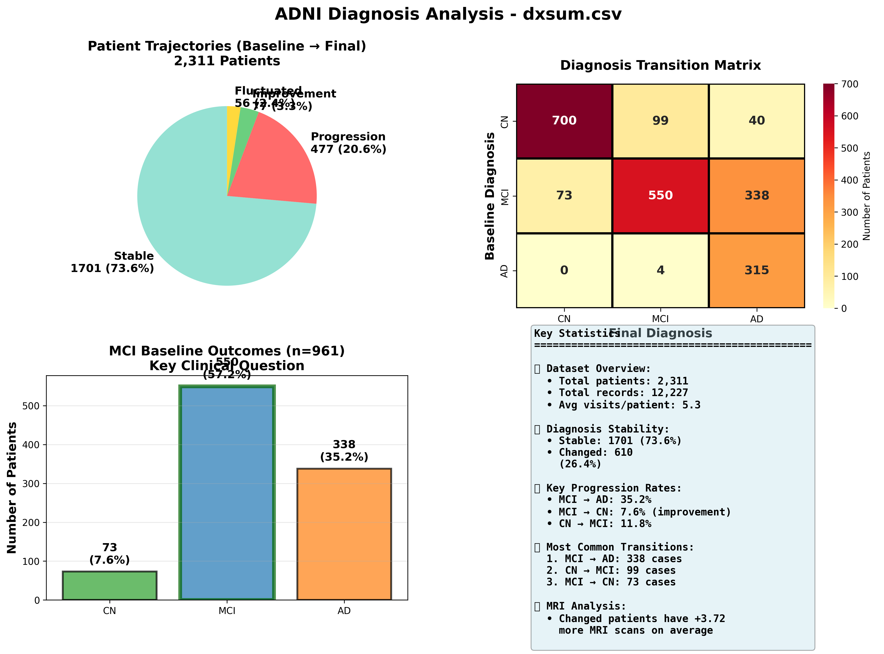

# ADNI Diagnosis Progression Analysis

Longitudinal analysis of diagnosis changes over time from the ADNI dxsum.csv dataset.

**Data source:** `dxsum.csv` - ADNI diagnosis summary with longitudinal patient visits

---

## 1. Dataset Overview

- **Total records:** 12227
- **Total unique patients:** 2311
- **Date range:** 2005-09-29 00:00:00 to 2025-10-03 00:00:00

### Visit Statistics

- Mean visits per patient: **5.29**
- Median visits per patient: **5.0**
- Range: **1 - 20** visits
- Standard deviation: 3.24

## 2. Diagnosis Code Mapping

| Code | Label | Description |
|------|-------|-------------|
| 1 | CN | Cognitively Normal |
| 2 | MCI | Mild Cognitive Impairment |
| 3 | AD | Alzheimer's Disease |

## 3. Diagnosis Distribution

### Overall Distribution (All Records)

| Diagnosis | Count | Percentage |
|-----------|-------|------------|
| CN | 4760 | 38.9% |
| MCI | 5088 | 41.6% |
| AD | 2355 | 19.3% |

### Baseline Distribution (First Visit)

| Diagnosis | Count | Percentage |
|-----------|-------|------------|
| CN | 909 | 39.3% |
| MCI | 1049 | 45.4% |
| AD | 353 | 15.3% |

### Final Distribution (Last Visit)

| Diagnosis | Count | Percentage |
|-----------|-------|------------|
| CN | 843 | 36.5% |
| MCI | 741 | 32.1% |
| AD | 727 | 31.5% |

## 4. Diagnosis Transition Analysis

### Overall Trajectory Summary

- **Stable diagnosis:** 1701 (73.6%)
- **Changed diagnosis:** 610 (26.4%)
  - Disease progression: 477 (20.6%)
  - Improvement: 77 (3.3%)
  - Fluctuated (returned to baseline): 56 (2.4%)

### Transition Frequencies

| Transition | Count | Percentage |
|------------|-------|------------|
| MCI → AD | 399 | 50.8% |
| CN → MCI | 198 | 25.2% |
| MCI → CN | 141 | 18.0% |
| AD → MCI | 34 | 4.3% |
| CN → AD | 11 | 1.4% |
| AD → CN | 2 | 0.3% |

### Detailed Fluctuation Patterns

**Patients who changed diagnosis but returned to baseline:**

Total fluctuated patients: **56**

| Pattern | Count | Avg Visits | Avg Transitions |
|---------|-------|------------|----------------|
| MCI → CN → MCI | 23 | 8.8 | 2.0 |
| CN → MCI → CN | 18 | 7.8 | 2.0 |
| MCI → AD → MCI | 10 | 6.3 | 2.0 |
| AD → MCI → AD | 2 | 4.0 | 2.0 |
| MCI → CN → MCI → CN → MCI | 1 | 10.0 | 4.0 |
| CN → MCI → CN → MCI → CN | 1 | 8.0 | 4.0 |
| MCI → AD → MCI → CN → MCI | 1 | 12.0 | 4.0 |

**Fluctuation by Baseline Diagnosis:**

- **CN baseline:** 19 patients fluctuated
- **MCI baseline:** 35 patients fluctuated
- **AD baseline:** 2 patients fluctuated

## 5. Progression Analysis by Baseline Diagnosis

### CN Patients (n=839)

| Final Diagnosis | Count | Percentage | Status |
|-----------------|-------|------------|--------|
| → CN | 700 | 83.4% | ✓ Stable |
| → MCI | 99 | 11.8% | ⚠️ Changed |
| → AD | 40 | 4.8% | ⚠️ Changed |

### MCI Patients (n=961)

| Final Diagnosis | Count | Percentage | Status |
|-----------------|-------|------------|--------|
| → CN | 73 | 7.6% | ⚠️ Changed |
| → MCI | 550 | 57.2% | ✓ Stable |
| → AD | 338 | 35.2% | ⚠️ Changed |

### AD Patients (n=319)

| Final Diagnosis | Count | Percentage | Status |
|-----------------|-------|------------|--------|
| → CN | 0 | 0.0% | ⚠️ Changed |
| → MCI | 4 | 1.3% | ⚠️ Changed |
| → AD | 315 | 98.7% | ✓ Stable |

## 6. Key Insights

### 🧠 CN Progression

- **99/839** (11.8%) progressed to MCI
- **40/839** (4.8%) progressed to AD
- **700/839** (83.4%) remained stable

### ⚠️ MCI Critical Window

- **338/961** (35.2%) progressed to AD
- **73/961** (7.6%) improved to CN
- **550/961** (57.2%) remained stable

### 📊 Overall Statistics

- **Overall Progression Rate:** 20.6%
- **Overall Stability Rate:** 73.6%
- **Most Common Transition:** MCI → AD (399 cases)

## 7. MRI Analysis by Diagnosis Stability

**Patients matched with MRI data:** 2290  
**Patients without MRI data:** 21

### MRI Count Statistics

| Group | N | Mean | Median | Range |
|-------|---|------|--------|-------|
| ✓ Stable | 1681 | 5.69 | 4.0 | 1-26 |
| ⚠️ Changed | 609 | 9.41 | 10.0 | 1-27 |

### 📊 Key Finding

Patients whose diagnosis **changed** have an average of **3.72 MORE** MRI scans compared to stable patients.

This suggests that patients with more longitudinal imaging data are more likely to show diagnosis changes, possibly due to better monitoring and detection of cognitive changes over time.

### 🔬 Scanner Information

| Manufacturer | Scans | Percentage |
|--------------|-------|------------|
| SIEMENS | 10040 | 65.4% |
| GE | 3223 | 21.0% |
| PHILIPS | 1927 | 12.6% |
| Philips | 150 | 1.0% |
| Siemens | 8 | 0.1% |
| Other | 1 | 0.0% |

### ⚡ Magnetic Field Strength

| Field Strength | Scans | Percentage |
|----------------|-------|------------|
| 3.0T | 9906 | 64.5% |
| 1.5T | 5443 | 35.5% |

---

## Summary

This analysis reveals important patterns in Alzheimer's disease progression:

- **73.6%** of patients maintain stable diagnosis over time
- **35.2%** of MCI patients progress to AD (critical intervention window)
- Patients with changing diagnoses have **3.72 more** MRI scans on average
- **MCI → AD** is the most common transition (399 cases, 50.8% of all transitions)
