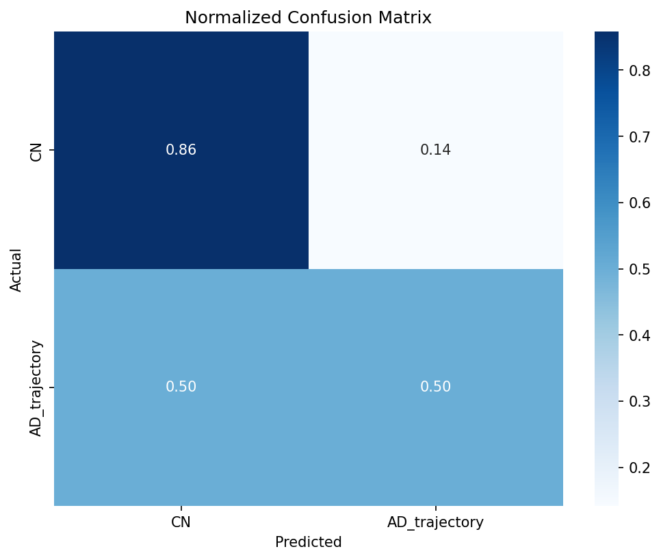
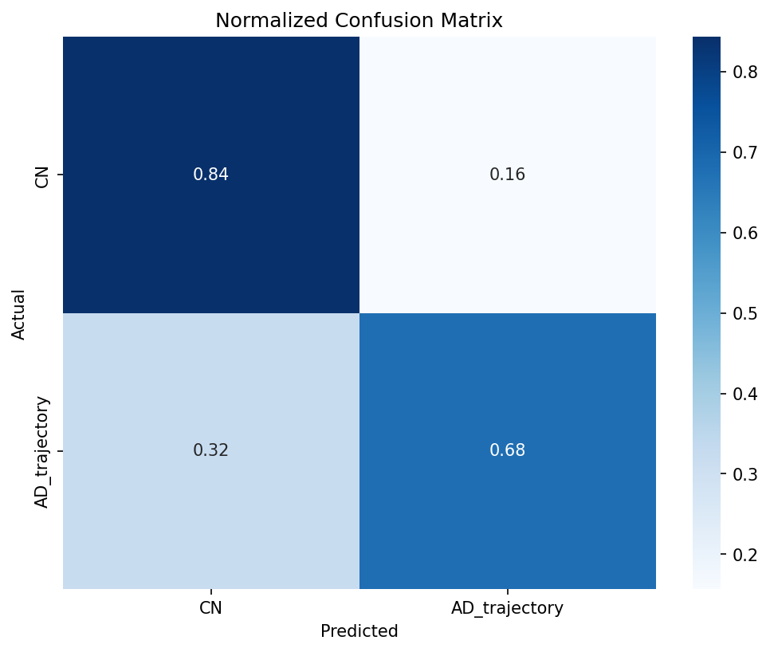

# Experiments Directory

This directory contains self-contained machine learning experiments for Alzheimer's disease research.

Each experiment has:
- ✅ Its own configuration file
- ✅ Numbered scripts (01, 02, 03...)
- ✅ Self-contained data directory
- ✅ Clear README

---

## Available Experiments

### 📈 [xgboost_tabular/](xgboost_tabular/)
**XGBoost on Tabular Clinical Data**

- **Goal**: CN vs AD Trajectory classification using clinical/tabular features
- **Model**: XGBoost
- **Task**: `cn_ad_trajectory` (CN vs AD + MCI converters)
- **Status**: Trained ✅

**Quick start:**
```bash
cd experiments/xgboost_tabular
python train.py --config configs/cn_ad_trajectory_adni.yaml
python train.py --config configs/cn_ad_trajectory_oasis.yaml
python train.py --config configs/cn_ad_trajectory_combined.yaml
```

**Results (CN vs AD Trajectory):**

| Dataset  | Accuracy | AUC-ROC | CN Recall | AD_trajectory Recall |
|----------|----------|---------|-----------|---------------------|
| ADNI     | 84.7%    | 0.928   | 89%       | 81%                 |
| OASIS    | 79.9%    | 0.778   | 86%       | 50%                 |
| Combined | 79.1%    | 0.879   | 84%       | 68%                 |

**Confusion Matrices:**

| ADNI | OASIS | Combined |
|------|-------|----------|
|  |  |  |

---

### 🧠 [mri_vit_ad/](mri_vit_ad/)
**3D Vision Transformer on MRI Scans**

- **Goal**: CN vs AD Trajectory classification using 3D MRI brain scans
- **Model**: 3D ViT-B with MAE pre-training (MICCAI 2024 paper)
- **Task**: `cn_ad_trajectory` (CN vs AD + MCI converters)
- **Dataset**: ADNI skull-stripped MRI (1610 patients)
- **Status**: Ready to train ✅

**Quick start:**
```bash
cd experiments/mri_vit_ad
python train.py --config config.yaml
```

---

### 📊 [pmci_smci_baseline/](pmci_smci_baseline/)
**Predicting MCI-to-AD Conversion**

- **Goal**: Binary classification (pMCI vs sMCI) using single baseline MRI
- **Model**: DenseNet3D
- **Dataset**: 455 patients (215 pMCI, 240 sMCI)
- **Status**: Ready to train ✅

**Quick start:**
```bash
cd experiments/pmci_smci_baseline
python 01_prepare_dataset.py
python 02_train_model.py
```

See [pmci_smci_baseline/README.md](pmci_smci_baseline/README.md) for details.

---

## Experiment Structure Template

Each experiment follows this structure:

```
experiments/experiment_name/
├── config.yaml              # Configuration (edit this!)
├── 01_prepare_dataset.py    # Step 1: Data preparation
├── 02_train_model.py        # Step 2: Training
├── 03_evaluate.py           # Step 3: Evaluation
├── dataset.py               # PyTorch dataset
├── data/                    # Self-contained data
│   ├── splits/              # Train/val/test splits
│   ├── checkpoints/         # Model checkpoints
│   └── logs/                # TensorBoard logs
└── README.md                # Experiment documentation
```

**Benefits:**
- 🎯 Self-contained (no scattered files)
- 📝 Clear pipeline (numbered steps)
- ⚙️ Single config file
- 🔄 Reproducible
- 🚀 Easy to run on cluster

---

## Creating a New Experiment

1. Copy an existing experiment folder
2. Rename it (e.g., `experiments/new_experiment/`)
3. Edit `config.yaml` with your settings
4. Update scripts as needed
5. Update `README.md` with your experiment description

---

## Old Structure (Deprecated)

The following directories are deprecated and will be cleaned up:

- ❌ `data_preparation/` → Moved to `experiments/*/01_prepare_dataset.py`
- ❌ `model_3d/mci_classification/` → Moved to `experiments/pmci_smci_baseline/`
- ❌ `outputs/mci_baseline/` → Moved to `experiments/pmci_smci_baseline/data/`

Keep:
- ✅ `model_3d/` (for reusable model architectures only)
- ✅ `ADNI_unimodal_models/` (DenseNet3D implementation)
- ✅ `preprocessing/` (image preprocessing pipeline)
- ✅ `data/` (original clinical/tabular data)
