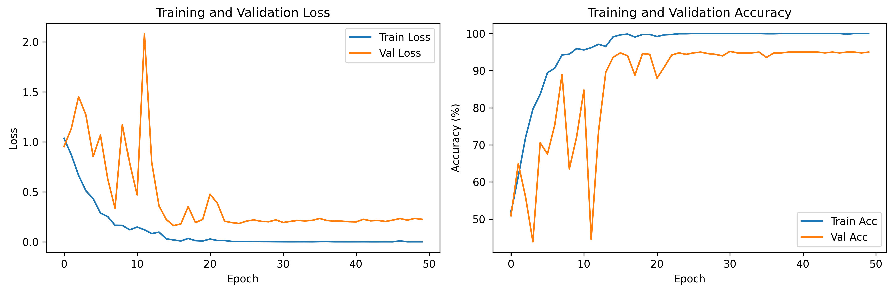
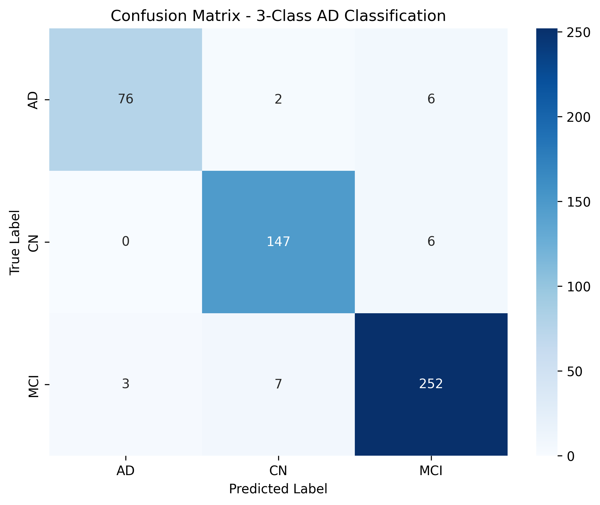

# 3D CNN Models for Alzheimer's Classification

This directory contains 3D Convolutional Neural Network models for classifying Alzheimer's Disease, Mild Cognitive Impairment, and Cognitively Normal subjects using volumetric brain MRI data.

## Overview

The 3D CNN approach processes entire brain volumes to classify subjects into three categories:

- **AD**: Alzheimer's Disease (433 subjects)
- **CN**: Cognitively Normal (746 subjects)
- **MCI**: Mild Cognitive Impairment (1316 subjects)

## Model Architecture

**3D ResNet**: Custom 3D ResNet architecture optimized for medical imaging

- **Input**: 192×20×192 hippocampus-focused brain volumes
- **Architecture**: 3D convolutional layers with residual connections
- **Output**: 3-class classification (AD/CN/MCI)

### Detailed Architecture

**ResNet3D Network Structure**:

1. **Initial Convolution Block**:
   - Conv3D: 1→64 channels, 7×7×7 kernel, stride=2
   - BatchNorm3D + ReLU activation
   - MaxPool3D: 3×3×3 kernel, stride=2

2. **Residual Blocks**:
   - **Layer 1**: 2×BasicBlock3D (64→64 channels, stride=1)
   - **Layer 2**: 2×BasicBlock3D (64→128 channels, stride=2)
   - **Layer 3**: 2×BasicBlock3D (128→256 channels, stride=2)
   - **Layer 4**: 2×BasicBlock3D (256→512 channels, stride=2)

3. **Classification Head**:
   - AdaptiveAvgPool3D: Global pooling to 1×1×1
   - Dropout: 50% regularization
   - Linear: 512→3 classes (AD/CN/MCI)

**BasicBlock3D Components**:

- Conv3D 3×3×3 → BatchNorm3D → ReLU
- Conv3D 3×3×3 → BatchNorm3D
- Residual connection with skip connections
- Downsampling convolution when stride≠1

**Total Parameters**: ~11M trainable parameters

## Performance Results

### Training Performance
- **Validation Accuracy**: 95.19%
- **Training Accuracy**: 99.98%
- **Final Loss**: 0.025 (training), 0.235 (validation)



The training curves show excellent convergence with:
- Rapid loss decrease in first 10 epochs
- Stable validation accuracy around 95%
- Minimal overfitting after epoch 15

### Classification Results



**Per-Class Performance**:
- **AD**: 76/84 correctly classified (90.5% recall)
- **CN**: 147/153 correctly classified (96.1% recall) 
- **MCI**: 252/262 correctly classified (96.2% recall)

**Cross-class Confusion**:
- AD � CN: 2 cases
- AD � MCI: 6 cases  
- CN � MCI: 6 cases
- MCI � AD: 3 cases
- MCI � CN: 7 cases

## Scripts

### `train_3class_classification.py`
Main training script for 3D CNN model:
```bash
# Train 3-class classification model
python train_3class_classification.py
```

**Key Features**:
- 3D ResNet architecture with batch normalization
- Weighted loss function for class imbalance
- Data augmentation (rotation, intensity scaling)
- Early stopping and learning rate scheduling
- Automatic model saving and evaluation

### `data_preprocessing_3class.py`
Data preprocessing pipeline for 3D volumes:
```bash
# Preprocess ADNIDenoise dataset
python data_preprocessing_3class.py
```

**Processing Steps**:
1. Load NIfTI brain volumes
2. Hippocampus region extraction
3. Resize to 192×20×192 
4. Intensity normalization
5. Train/validation/test splitting

## Model Output

- **Saved Model**: `best_ad_mci_cn_model.pth`
- **Training Curves**: `training_curves_3class.png`
- **Confusion Matrix**: `confusion_matrix_3class.png`

## Technical Details

**Dataset Distribution**:
- Total subjects: 2495
- Training: ~80% (1996 subjects)
- Validation: ~20% (499 subjects)

**Hardware Requirements**:
- GPU with ≥8GB VRAM recommended
- Training time: ~2-3 hours on modern GPU

**Key Advantages**:
- High accuracy (95.19%) on validation set
- Robust performance across all three classes
- End-to-end learning from raw brain volumes
- No manual feature engineering required

## Usage Notes

The 3D CNN approach is ideal when:
- Full volumetric brain data is available
- High computational resources are accessible
- Maximum accuracy is prioritized over interpretability
- Sufficient training data exists (2000+ subjects)