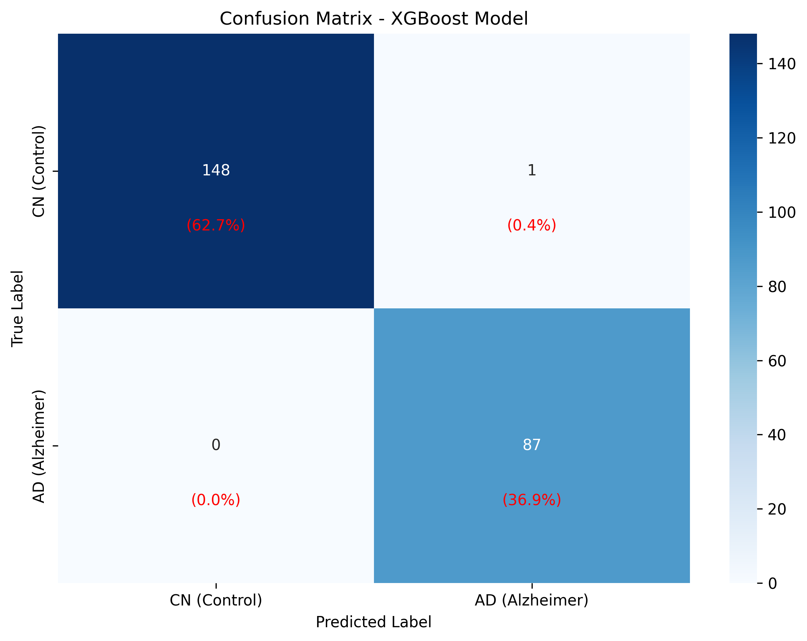
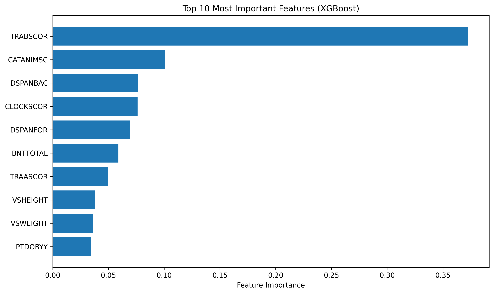

# XGBoost for Alzheimer's Disease Classification

## Overview

Comprehensive machine learning approach using XGBoost to:

1. **Classify CN vs AD** - Distinguish Alzheimer's Disease from Cognitively Normal subjects
2. **Predict MCI Direction** - Classify MCI patients as CN-like (stable) or AD-like (at risk)

Uses clinical and neuropsychological assessment data from the ADNI dataset.

## Project Structure

```
tabular/
└── xgboost/
    ├── train.py    # Train XGBoost model on CN vs AD (clean data)
    └── run.py      # Predict MCI patient direction (all groups data)
```

**Outputs organized in:**

```
outputs/tabular/
├── models/          # Trained models (.pkl, .json)
├── predictions/     # CSV predictions and metrics
├── visualizations/  # PNG plots and charts
└── reports/         # Analysis reports
```

## Quick Start

### Train Model

```bash
cd tabular/xgboost
python3 train.py
```

### Predict MCI Direction

```bash
cd tabular/xgboost
python3 run.py
```

## Dataset Analysis

### Training Dataset (AD_CN_clinical_data.csv)

**ADNI Clinical Dataset**: 1,179 subjects with comprehensive neuropsychological assessments

**Subject Distribution:**

- **Cognitively Normal (CN)**: 746 subjects (63.3%)
- **Alzheimer's Disease (AD)**: 433 subjects (36.7%)
- **Class Imbalance Ratio**: 1.72:1 (CN:AD)

### Full Dataset (clinical_data_all_groups.csv)

**Total**: 1,980 samples from 1,472 unique patients

**Distribution by Group:**

- **CN**: 859 samples (564 patients, 1.52 scans/patient)
- **MCI**: 845 samples (681 patients, 1.24 scans/patient)
- **AD**: 276 samples (234 patients, 1.18 scans/patient)

**Data Quality Issues:**

- **30-70% missing data** in most features
- Demographics (PTDOBYY, PTEDUCAT, PTRACCAT): ~70% missing
- Cognitive tests (TRAASCOR, TRABSCOR, etc.): 30-60% missing
- Imputation strategy: Median for numeric, mode for categorical

### Clinical Features (13 Variables)

**Neuropsychological Assessments**:

- `TRABSCOR`: Trail Making Test B (Executive function)
- `CATANIMSC`: Category Fluency Animals (Semantic memory)
- `BNTTOTAL`: Boston Naming Test (Language/word retrieval)
- `CLOCKSCOR`: Clock Drawing Test (Visuospatial/executive)
- `DSPANBAC`: Digit Span Backward (Working memory)
- `DSPANFOR`: Digit Span Forward (Attention)
- `TRAASCOR`: Trail Making Test A (Processing speed)

**Demographics & Physical**:

- `PTGENDER`: Gender (0=Female, 1=Male)
- `PTDOBYY`: Birth year (Age proxy)
- `PTEDUCAT`: Years of education
- `PTRACCAT`: Race category
- `VSWEIGHT`: Weight (kg)
- `VSHEIGHT`: Height (cm)

## Methodology

### Data Splitting Strategy (70/10/20)

**Stratified sampling** to maintain class balance across all splits:

- **Training Set**: 825 subjects (CN: 522, AD: 303)
- **Validation Set**: 118 subjects (CN: 75, AD: 43)
- **Test Set**: 236 subjects (CN: 149, AD: 87)

### Model Configuration

**XGBoost Parameters**:

- 300 estimators with early stopping
- Max depth: 6
- Learning rate: 0.1
- Early stopping: 50 rounds on validation set
- Best iteration achieved: 299

## Performance Results

### Validation Set Performance

Perfect performance on validation set (118 subjects):

- **Accuracy**: 100.0%
- **Precision**: 100.0%
- **Recall (Sensitivity)**: 100.0%
- **F1 Score**: 100.0%
- **Specificity**: 100.0%
- **AD Detection**: 43/43 cases (100%)

### Test Set Performance

Near-perfect generalization on unseen test data (236 subjects):

- **Accuracy**: 99.6%
- **Precision**: 98.9%
- **Recall (Sensitivity)**: 100.0%
- **F1 Score**: 99.4%
- **Specificity**: 99.3%
- **AD Detection**: 87/87 cases (100%)

### Confusion Matrix Analysis



**Test Set Confusion Matrix**:

```
           Predicted
           CN   AD
True CN   148    1   (99.3% specificity)
True AD     0   87   (100% sensitivity)
```

**Key Clinical Findings**:

- **Zero false negatives**: No AD cases missed (critical for patient safety)
- **Minimal false positives**: Only 1 CN subject misclassified as AD (0.4% of test set)
- **Perfect AD detection**: 100% sensitivity ensures early intervention opportunities

## Feature Importance Analysis



### Top Predictive Features

Based on XGBoost feature importance scores:

1. **TRABSCOR** (37.3%): Trail Making Test B - Executive function
2. **CATANIMSC** (10.1%): Category Fluency Animals - Semantic memory
3. **DSPANBAC** (7.6%): Digit Span Backward - Working memory
4. **CLOCKSCOR** (7.6%): Clock Drawing Test - Visuospatial/executive
5. **DSPANFOR** (7.0%): Digit Span Forward - Attention
6. **BNTTOTAL** (5.9%): Boston Naming Test - Language
7. **TRAASCOR** (4.9%): Trail Making Test A - Processing speed
8. **VSHEIGHT** (3.8%): Height - Physical characteristics
9. **VSWEIGHT** (3.6%): Weight - Physical characteristics
10. **PTDOBYY** (3.4%): Birth year - Age factor

### Clinical Interpretation

**Executive Function Dominance**: Trail Making Test B (TRABSCOR) accounts for 37.3% of model decisions, highlighting the critical role of executive dysfunction in AD classification.

**Cognitive Domain Hierarchy**:

1. **Executive Function** (37.3%) - Primary discriminator
2. **Semantic Memory** (10.1%) - Secondary importance
3. **Working Memory** (7.6%) - Tertiary factor
4. **Visuospatial Processing** (7.6%) - Equal importance to working memory
5. **Attention** (7.0%) - Supporting cognitive domain

## Validation Results

**Validation vs Test Performance Comparison**:

| Metric | Validation | Test | Difference |
|--------|------------|------|------------|
| Accuracy | 100.0% | 99.6% | -0.4% |
| Precision | 100.0% | 98.9% | -1.1% |
| Recall | 100.0% | 100.0% | 0.0% |
| F1 Score | 100.0% | 99.4% | -0.6% |

**Excellent Generalization**: Minimal performance drop from validation to test set indicates robust model generalization.

## MCI Patient Prediction Results

### Overview

The trained CN vs AD model is applied to **845 MCI patients** to predict their progression risk.

### MCI Classification Results

**Distribution:**

- **CN-like (Stable)**: 509 patients (60.2%)
  - Cognitive patterns similar to healthy controls
  - Lower risk of progression to AD

- **AD-like (At Risk)**: 336 patients (39.8%)
  - Cognitive patterns similar to AD patients
  - Higher risk of progression to AD

**Probability Statistics:**

- Mean AD Probability: 0.366
- Median AD Probability: 0.037 (most patients cluster toward CN)
- Range: 0.000 to 1.000

### Model Performance on Known Groups (Full Dataset)

When applied to the full dataset with missing data:

**CN Patients (n=859):**
- Predicted as CN: 750 (87.3%)
- Predicted as AD: 109 (12.7%)

**MCI Patients (n=845):**
- Predicted as CN-like: 509 (60.2%)
- Predicted as AD-like: 336 (39.8%)

**AD Patients (n=276):**
- Predicted as CN: 79 (28.6%)
- Predicted as AD: 197 (71.4%)

### Important Note on Missing Data Impact

The full dataset has **30-70% missing data**, which significantly impacts prediction accuracy:

- Model was trained on clean data (minimal missing values)
- Full dataset predictions use median/mode imputation
- AD detection drops from 100% (clean data) to 71.4% (missing data)
- Results should be interpreted with caution due to data quality issues

### Clinical Interpretation

**For MCI Patients:**

1. **CN-like (60%)**: Monitor regularly, may remain stable or revert to normal
2. **AD-like (40%)**: Closer monitoring recommended, consider early intervention

**Risk Stratification Available:**

- Very CN-like (0.0-0.2): Very low risk
- CN-like (0.2-0.4): Low risk
- Uncertain (0.4-0.6): Moderate risk
- AD-like (0.6-0.8): High risk
- Very AD-like (0.8-1.0): Very high risk

## Output Files

All outputs are organized in `outputs/tabular/`:

### Models
- `models/xgboost_model.pkl` - Trained model (pickle)
- `models/xgboost_model.json` - Trained model (XGBoost native)

### Predictions
- `predictions/mci_predictions.csv` - MCI patient predictions
- `predictions/predictions_all_groups.csv` - All patient predictions
- `predictions/feature_importance.csv` - Feature rankings
- `predictions/xgboost_results.csv` - Model metrics

### Visualizations
- `visualizations/mci_predictions_visualization.png` - MCI analysis charts
- `visualizations/confusion_matrix_xgboost.png` - Confusion matrix
- `visualizations/feature_importance_plot.png` - Feature importance

## References

- **ADNI**: Alzheimer's Disease Neuroimaging Initiative
- **Dataset**: 1,472 unique patients, 1,980 MRI scans
- **Model**: XGBoost with 300 estimators, early stopping
- **Training**: 70/10/20 split (train/val/test)
