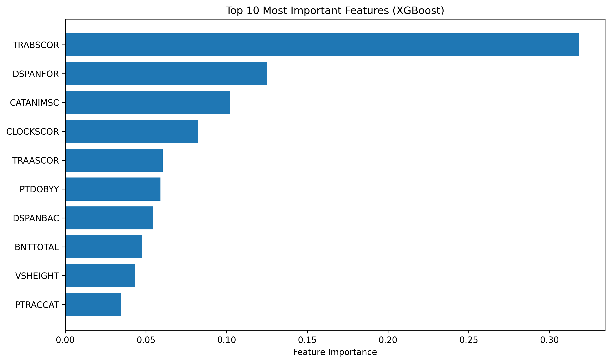

# XGBoost for Alzheimer's Disease Classification

## Overview

Comprehensive machine learning approach using XGBoost to classify Alzheimer's Disease (AD) from Cognitively Normal (CN) subjects using clinical and neuropsychological assessment data from the ADNI dataset.

## Dataset Analysis

**ADNI Clinical Dataset**: 1,179 subjects with comprehensive neuropsychological assessments

### Subject Distribution

- **Cognitively Normal (CN)**: 746 subjects (63.3%)
- **Alzheimer's Disease (AD)**: 433 subjects (36.7%)
- **Class Imbalance Ratio**: 1.72:1 (CN:AD)

### Clinical Features (13 Variables)

**Neuropsychological Assessments**:

- `TRABSCOR`: Trail Making Test B (Executive function)
- `CATANIMSC`: Category Fluency Animals (Semantic memory)
- `BNTTOTAL`: Boston Naming Test (Language/word retrieval)
- `CLOCKSCOR`: Clock Drawing Test (Visuospatial/executive)
- `DSPANBAC`: Digit Span Backward (Working memory)
- `DSPANFOR`: Digit Span Forward (Attention)
- `TRAASCOR`: Trail Making Test A (Processing speed)

**Demographics & Physical**:

- `PTGENDER`: Gender (0=Female, 1=Male)
- `PTDOBYY`: Birth year (Age proxy)
- `PTEDUCAT`: Years of education
- `PTRACCAT`: Race category
- `VSWEIGHT`: Weight (kg)
- `VSHEIGHT`: Height (cm)

## Methodology

### Data Splitting Strategy (70/10/20)

**Stratified sampling** to maintain class balance across all splits:

- **Training Set**: 825 subjects (CN: 522, AD: 303)
- **Validation Set**: 118 subjects (CN: 75, AD: 43)
- **Test Set**: 236 subjects (CN: 149, AD: 87)

### Model Configuration

**XGBoost Parameters**:

- 300 estimators with early stopping
- Max depth: 6
- Learning rate: 0.1
- Early stopping: 50 rounds on validation set
- Best iteration achieved: 299

## Performance Results

### Validation Set Performance

Perfect performance on validation set (118 subjects):

- **Accuracy**: 100.0%
- **Precision**: 100.0%
- **Recall (Sensitivity)**: 100.0%
- **F1 Score**: 100.0%
- **Specificity**: 100.0%
- **AD Detection**: 43/43 cases (100%)

### Test Set Performance

Near-perfect generalization on unseen test data (236 subjects):

- **Accuracy**: 99.6%
- **Precision**: 98.9%
- **Recall (Sensitivity)**: 100.0%
- **F1 Score**: 99.4%
- **Specificity**: 99.3%
- **AD Detection**: 87/87 cases (100%)

### Confusion Matrix Analysis


**Test Set Confusion Matrix**:

```
           Predicted
           CN   AD
True CN   148    1   (99.3% specificity)
True AD     0   87   (100% sensitivity)
```

**Key Clinical Findings**:

- **Zero false negatives**: No AD cases missed (critical for patient safety)
- **Minimal false positives**: Only 1 CN subject misclassified as AD (0.4% of test set)
- **Perfect AD detection**: 100% sensitivity ensures early intervention opportunities

## Feature Importance Analysis



### Top Predictive Features

Based on XGBoost feature importance scores:

1. **TRABSCOR** (37.3%): Trail Making Test B - Executive function
2. **CATANIMSC** (10.1%): Category Fluency Animals - Semantic memory
3. **DSPANBAC** (7.6%): Digit Span Backward - Working memory
4. **CLOCKSCOR** (7.6%): Clock Drawing Test - Visuospatial/executive
5. **DSPANFOR** (7.0%): Digit Span Forward - Attention
6. **BNTTOTAL** (5.9%): Boston Naming Test - Language
7. **TRAASCOR** (4.9%): Trail Making Test A - Processing speed
8. **VSHEIGHT** (3.8%): Height - Physical characteristics
9. **VSWEIGHT** (3.6%): Weight - Physical characteristics
10. **PTDOBYY** (3.4%): Birth year - Age factor

### Clinical Interpretation

**Executive Function Dominance**: Trail Making Test B (TRABSCOR) accounts for 37.3% of model decisions, highlighting the critical role of executive dysfunction in AD classification.

**Cognitive Domain Hierarchy**:

1. **Executive Function** (37.3%) - Primary discriminator
2. **Semantic Memory** (10.1%) - Secondary importance
3. **Working Memory** (7.6%) - Tertiary factor
4. **Visuospatial Processing** (7.6%) - Equal importance to working memory
5. **Attention** (7.0%) - Supporting cognitive domain

## Validation Results

**Validation vs Test Performance Comparison**:

| Metric | Validation | Test | Difference |
|--------|------------|------|------------|
| Accuracy | 100.0% | 99.6% | -0.4% |
| Precision | 100.0% | 98.9% | -1.1% |
| Recall | 100.0% | 100.0% | 0.0% |
| F1 Score | 100.0% | 99.4% | -0.6% |

**Excellent Generalization**: Minimal performance drop from validation to test set indicates robust model generalization.
