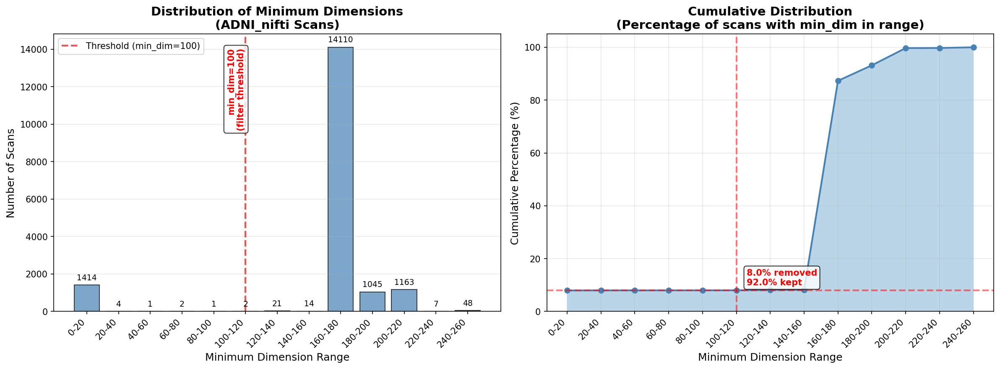

# Utility Scripts

Quick reference for visualization and data processing utilities.

---

## Visualize Single MRI

View a single brain scan with 3 anatomical views (axial, coronal, sagittal).

```bash
python utils/visualize.py
```

Edit line 10 to change the scan path.

---

## Visualize Multiple MRI Scans

Browse through a list of scans using arrow keys.

```bash
# View all required scans for cn_mci_ad_3dhcct
python utils/visualize_scan_list.py \
  --scan-list experiments/cn_mci_ad_3dhcct/required_scans.txt

# View first 10 scans only (for testing)
python utils/visualize_scan_list.py \
  --scan-list experiments/cn_mci_ad_3dhcct/required_scans.txt \
  --limit 10

# Start at scan #100
python utils/visualize_scan_list.py \
  --scan-list experiments/cn_mci_ad_3dhcct/required_scans.txt \
  --start-index 100
```

**Keyboard shortcuts:**
- `←` Previous scan
- `→` Next scan
- `↑` Next slice
- `↓` Previous slice

---

## Compare Preprocessing Stages

View the same patient across all three preprocessing stages side-by-side (ADNI_nifti, ADNI_skull, ADNI_nppy).

```bash
# Compare all patients
python utils/compare_preprocessing.py

# Start at specific patient
python utils/compare_preprocessing.py --patient 002_S_0295

# Compare specific list of patients
python utils/compare_preprocessing.py \
  --patient-list experiments/cn_mci_ad_3dhcct/required_patients.txt
```

**Keyboard shortcuts:**
- `←` Previous patient
- `→` Next patient
- `↑` Next slice
- `↓` Previous slice

Shows 3×3 grid: 3 preprocessing stages (rows) × 3 anatomical views (columns).

**Display Features:**
- Scan filename displayed in each subplot title
- Scan dimensions (e.g., "Shape: 256×256×170")
- Grid overlay for spatial reference
- Useful for identifying sagittal scans that appear stretched in axial view

---

## Create Baseline Scans Archive

Package only the required baseline scans into a tar.gz archive for easy transfer or backup.

```bash
# Create compressed archive (~1,684 baseline scans)
python utils/create_baseline_archive.py \
  --scan-list experiments/cn_mci_ad_3dhcct/required_scans.txt \
  --output ADNI_nifti_baseline.tar.gz

# Extract archive
tar -xzf ADNI_nifti_baseline.tar.gz
```

**Options:**
- `--compression gz` - gzip (default, fast)
- `--compression bz2` - bzip2 (better compression, slower)
- `--compression xz` - xz (best compression, slowest)
- `--compression none` - no compression (fastest)

---

## Analyze Scan Dimensions

Analyze and visualize the dimension distribution of MRI scans to identify quality issues (4D volumes, localizers, etc.).

```bash
# Analyze entire ADNI dataset
python utils/analyze_scan_dimensions.py \
  --input-dir /Volumes/KINGSTON/ADNI_nifti \
  --output adni_dimension_distribution.png

# Analyze specific scan list (e.g., required scans)
python utils/analyze_scan_dimensions.py \
  --scan-list experiments/cn_mci_ad_3dhcct/required_scans.txt \
  --output experiments/cn_mci_ad_3dhcct/dimension_distribution.png

# Use different bin size (default: 20 slices)
python utils/analyze_scan_dimensions.py \
  --input-dir /Volumes/KINGSTON/ADNI_nifti \
  --output dimension_dist.png \
  --bin-size 10
```

**Output**:
- Histogram showing distribution of minimum dimensions (0-20, 20-40, etc.)
- Cumulative distribution plot
- Detailed statistics table
- Filter analysis at common thresholds (50, 80, 100, 120, 150)

**ADNI Dataset Statistics** (17,832 total scans):
- **Whitelisted**: 16,353 scans (91.7%) - good quality with min_dim ≥ 100
- **Blacklisted**: 1,479 scans (8.3%) - localizers/corrupted with min_dim < 100
- Most scans (79.1%) have min_dim in 160-180 range
- 127 scans (0.7%) were 4D with shape[3]==1, converted to 3D

**Quality Control Results**:
- ✅ **Whitelist**: 16,353 scans ready for preprocessing (`ADNI_dimension_whitelist.txt`)
- ❌ **Blacklist**: 1,479 scans filtered out (`ADNI_dimension_blacklist.txt`)
- 📊 **Details**: Full analysis with shapes and reasons (`ADNI_dimension_details.txt`)

**4D Scan Conversion**:
- Total 4D scans found: 127 (0.7% of dataset)
- Successfully converted: 127 scans (shape like `(256, 256, 170, 1)` → `(256, 256, 170)`)
- Backups created: All original 4D files preserved with `.4d_backup` extension
- To restore: `mv file.nii.gz.4d_backup file.nii.gz`



---

## Create Dimension Blacklist

Create a blacklist of scans with problematic dimensions (localizers, corrupted scans).

```bash
# Create blacklist from entire ADNI dataset
python utils/create_dimension_blacklist.py \
  --input-dir /Volumes/KINGSTON/ADNI_nifti \
  --output ADNI_dimension_blacklist.txt \
  --min-dim 100

# Also create whitelist (good scans)
python utils/create_dimension_blacklist.py \
  --input-dir /Volumes/KINGSTON/ADNI_nifti \
  --output ADNI_dimension_blacklist.txt \
  --whitelist ADNI_dimension_whitelist.txt \
  --min-dim 100 \
  --details ADNI_dimension_analysis.txt

# Create blacklist from specific scan list
python utils/create_dimension_blacklist.py \
  --scan-list all_scans.txt \
  --output blacklist.txt \
  --min-dim 100
```

**Output files**:
- Blacklist: Scans that fail dimension requirements
- Whitelist: Scans that pass dimension requirements (optional)
- Details: Full analysis with shapes and rejection reasons (optional)

**Filtering criteria**:
- Rejects scans with min_dim < threshold (default 100)
- Automatically squeezes 4D scans with shape[3]==1 before analysis
- Rejects 4D multi-volume scans (fMRI, DTI)

---

## Generate Tabular Features

Create CSV with clinical features for ADNI patients.

```bash
python utils/gen_tabular.py
```

Merges multiple ADNI CSV files into a single tabular dataset.
